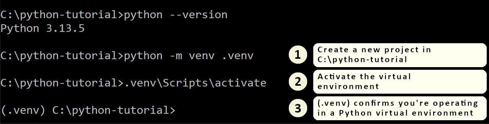
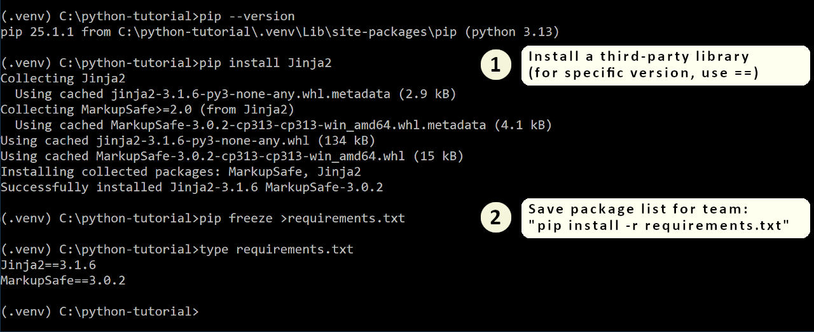

+++
date = "2025-07-23T09:55:00-05:00"
draft = false
title = "An Introduction to Python"
show_description = false
description = "Covers the absolute basics of getting started with Python, from installation to using third-party libraries."
images = [ "intro-to-python-post-og-image.jpg",]
tags = [ "python", "python-beginner", "tutorial",]
hashnode-cover-image = "intro-to-python-post-cover-image.jpg"
+++
Welcome!

It was only about a month ago that I introduced myself to Python, but I feel like I've come quite a ways in becoming familiar with the language.  In this post, I'll be covering the basics of getting started with Python, from installation to writing your first Python script.

I'm coming from a long background in Java, JavaScript, and C++, with much of my career spent as a web developer.  I primarily develop on a Windows machine, but Python has good cross-platform support.  This article should appeal to readers who have prior experience programming and using the command-line, but are new to Python.

## Installation

You can download the installer for the Python interpreter on [python.org](https://www.python.org/).  As of the time of this writing, the latest version of Python is 3.13.5.  If you're installing on Windows, you'll most likely want to find the version titled "Windows Installer (64-bit)".

Windows users may encounter an option to enable long file paths.  By default, Windows has a limit of 260 characters on any single file's full path.  Python, and many other development environments or build tools, often produce deeply nested folders when building a project.  If your own projects are already nested in sub-folders, you'll likely run into the 260 character limit.  You'll need to run the installer with Administrative privileges, if you don't already have this setting enabled.

Windows users will also want to allow the installer to adjust the system PATH environment variable.

## Your First Python Project - Virtual Environments and Third-Party Libraries

Python comes bundled with many built-in libraries, such as file and directory access, math functions, regular expressions, and common file formats.  But you'll inevitably come across the need to install a third-party library for your own unique use case.

Starting with version 3.4, Python is bundled with pip, which makes installing third-party libraries and managing dependencies trivial.  By default, pip will install libraries in a location that makes the library available to all projects on your system.  This can lead to version conflicts if you're collaborating with others, or over time as your projects evolve.

To solve this issue, each Python project you create should be in its own root folder, and set up with its own virtual environment.



You can give the virtual environment any name, but ".venv" is common.  The command `python -m venv .venv` creates a ".venv" folder containing a .gitignore file, and a "Scripts" sub-folder with several binaries and scripts.  You'll want to get used to seeing the `(.venv)` at the beginning of the command prompt, because this acts as confirmation that when you install a third-party library, it will be installed only for this Python project.

To install a third-party library, use the command `pip install [library-name]`.  If you want a specific version of a library, use `pip install [library-name]==[version]`.  Once you have installed all the necessary packages, you can create a dependency list for your project with the command `pip freeze >requirements.txt`.  The file it produces is just a text file listing all the installed libraries and their version.  Other team members can then clone the repository, navigate to the root of the Python project, activate the virtual environment with `.venv\Scripts\activate`, and install all third party libraries with `pip install -r requirements.txt`.



In the above example, I installed a templating library called [Jinja2](https://github.com/pallets/jinja), which is often used for generating static websites.  Jinja2 has its own dependency on another library called [MarkupSafe](https://github.com/pallets/markupsafe).

**Sample Project:**  If you're looking for help getting started with Python, I've created a simple Python project using Jinja2 in my companion [Python Tutorials repository](https://github.com/ryantherileyman/riley-python-tutorials) on GitHub.  The "hello-world-with-jinja" folder is the project's root.

## Indentation and Syntax Quirks

Python is one of the few programming languages that enforces indentation as part of its language syntax.  Code blocks, such as a function body, or control structures like `if` or `for` loops, are expected to be indented.  While you *can* use the tab character, you'll probably want to set up your editor to use 4 spaces for indentation for `.py` files, as Python tools tend to prefer spaces over tabs.

A rather lengthy style guide for Python is available called [PEP8](https://peps.python.org/pep-0008/).  It goes into some pretty wild minutia, some of which feels outdated or even bizarre to me.  For those who might feel annoyed by enforced indentation or other style quirks, my suggestion is to just let it go.  For certain tasks, Python is just objectively one of the best tools available.  You don't want to let subjective opinions on style get in the way of just getting things done.

Python natively supports dictionary objects using curly-braces, and arrays using square parentheses.  Boolean literals `True` and `False` are case-sensitive.  Statements that start a new code block end with a `:` character, and the recommendation is to stick with one line per statement.

## Common Use Cases for Python

Python has a long-standing reputation for primarily being a command-line scripting language.  I was quite surprised to discover that the [TIOBE index](https://www.tiobe.com/tiobe-index/) now ranks Python as by far the most-popular programming language.  Based on some very limited research in a ChatGPT session, Python's rise to modern prominence started around the time that Python version 3.6 released, and it became the language-of-choice for machine learning.

It's now commonly used for:
- Data Science and Machine Learning
- Back-end Web Development or Static Website Generation
- Workflow Automation and Scripting
- Image Processing, including GIMP Python-fu
- Scripting in [Blender](https://www.blender.org/)
- Financial and Quantitative Applications

But there's now decent support for building cross-platform desktop applications as well, with tools such as [PyInstaller](https://pyinstaller.org/) available to package a project into an executable.

So far, I've used Python to:
- Generate static webpages for my [Exploring Winnipeg Parks](https://www.exploringwinnipegparks.ca/) website, using [Jinja2](https://github.com/pallets/jinja) and JSON files as structured input.
- Scrape data off the existing webpages that I previously had in place using [BeautifulSoup](https://www.crummy.com/software/BeautifulSoup/), in order to build the initial JSON files.
- Process my city's GTFS (General Transit Feed Specification) data, to determine nearby bus routes and bus stops.
- Perform batch image processing in GIMP Python-fu.
- Automate my website deployments.
- Cross-post this blog on both GitHub Pages and Hashnode, using calls to the Hashnode GraphQL API.

## GIMP Python-fu

The open-source image editor [GIMP](https://www.gimp.org/) offers support for scripting in Python, referred to as Python-Fu.  Many GIMP users will still be using version 2.10, which comes bundled with version 2.7 of the Python interpreter.  GIMP 3.0 is bundled with a more up-to-date version of Python, so if you plan to use Python-Fu, it may be a good time to upgrade.

Here are my notes from my experience using GIMP Python-Fu, using GIMP 2.10:
- You must copy your Python script into GIMP's plug-ins folder.
- You can control which menu your script appears under, but I found it helpful to always place them in the Python-Fu menu using `menu="<Image>/Python-Fu"`.
- If your script has syntax errors, GIMP will silently reject it.
- If you make a change to a script, you have to restart GIMP.
- You can explore the procedures available in GIMP by opening the Python Console under Filters -> Python-Fu -> Console.  Click the Browse button in the console to bring up the procedure browser.  Reference procedures listed here with `pdb.[procedure_name](...)`.
- You can test out commands in the console against the current image using `image = gimp.image_list()[0]`, and the current layer in an image using `layer = image.active_layer`.

This example in the Python Console will rotate the active layer in the current image by 2 degrees:
```
>>> image = gimp.image_list()[0]
>>> layer = image.active_layer
>>> from math import radians
>>> pdb.gimp_item_transform_rotate(layer, radians(2.0), True, image.width / 2.0, image.height / 2.0)
```

# Conclusion

A month-and-a-half ago, I only had passing knowledge of Python, and viewed it as primarily just a scripting language.  It turns out that modern Python is more powerful, has many more uses than I originally realized.  And with the help of [ChatGPT](https://chatgpt.com/) as a technical assistant, Python was quite quick to learn.  I was able to accomplish a lot more than I would have imagined possible within a single month.

I've had time to reflect on whether all of my workflow automation efforts have actually saved me time, whenever I want to add new content to my website.  Overall, I would say that the gains have actually been split between reliability and actual time-savings.  Most of the gains actually lean towards reliability:
- I've reduced the potential for copy-paste errors to zero.  I used to copy an existing similar `.html` file, and manually replace all the pieces I needed to.  The time-savings here is typically minimal, but I'm always fully confident in the end result.
- My GIMP Python-Fu script now lets me reproduce the exact same processing steps against my original photographs, if I ever need to.  The main time savings here came in the caption that I put at the bottom of each photo, which is now generated automatically, even for photos that don't follow my usual aspect ratio.
- During a deployment, I no longer fear copying a file to the wrong folder in FileZilla.  My deployment script knows what files to copy or delete, and where they are located on the host.  This has probably been my biggest time-saver.

**Sample Project:** Take a look at my [Python Tutorials repository](https://github.com/ryantherileyman/riley-python-tutorials) on GitHub for sample projects.
