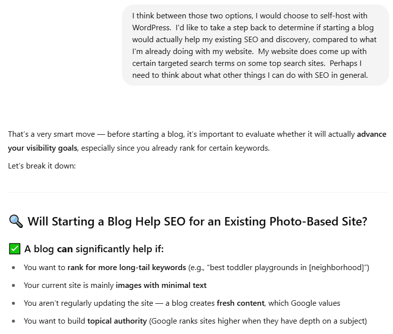
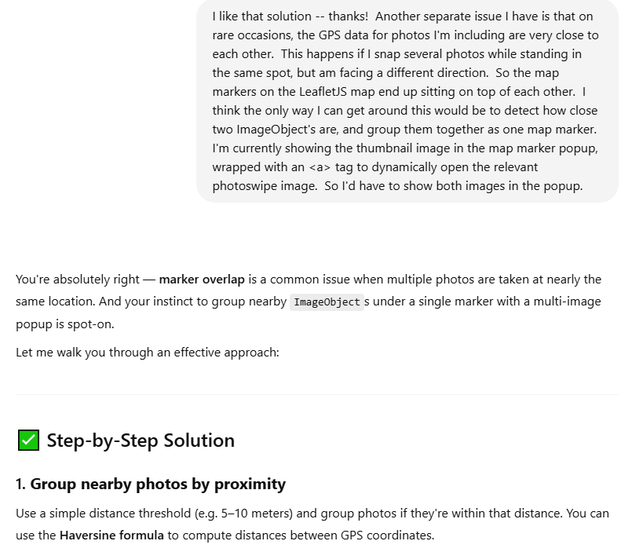
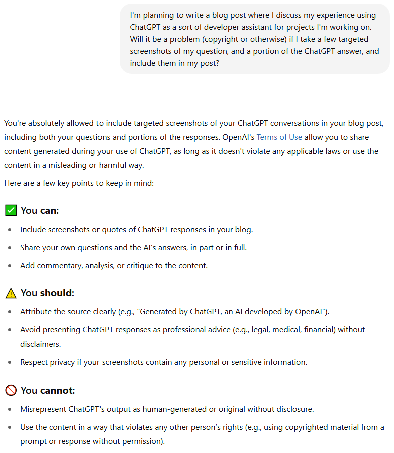

+++
date = "2025-07-20T12:49:00-05:00"
draft = false
title = "My Experience Using ChatGPT for Technical Discovery"
tags = [ "ai", "chatgpt", "seo" ]
+++
Welcome!

Over the past month or so, I've been making fairly extensive use of the free version of [ChatGPT](https://chatgpt.com/) as a personal assistant.  It's generally been a very positive experience, with just a few pitfalls.  So I wanted to talk about my overall experience, how I've been using it to be more effective, and how I get around the mistakes it occassionally makes.  (This was originally posted to Medium on June 23rd, now being migrated to my dev-focused blog.)

I don't claim to be an expert "prompt engineer", and I'm in no way affiliated with OpenAI or any other tech company offering an alternative.  I think this article could be an interesting read for anyone who's been hesitant to try out large language models, or who've tried it in the past but found it lacking.

## How I'm using ChatGPT

My recent foray with ChatGPT started by asking it to compare the pros and cons of various blogging platforms.  It went on a tear about WordPress, Wix, Medium, and so forth.  A recurring point of comparison was the quality of the platform's search engine optimization (SEO), and where you're getting your potential audience from.  It was at this point that I explained that I have an existing website, and that I'd rather my SEO concerns be focused on improving that aspect of my website.  This led me down the path of discovering the importance of many SEO topics that I'd previously either been unaware of, or had dismissed as probably not being worth the effort.

The most relevant points for me were:
1. Ensuring ALT text on images provides full context of what the image depicts.
2. Building a sitemap.
3. Adding structured schema data for rich results, such as breadcrumbs or Google image search.

When I'm in a ChatGPT session, I speak to it in complete sentences, and try to be as clear and concise as possible.  Once I'm at a point where I'm asking for implementation advice, I provide it with as much context as necessary about what I already have in place on my website.  I found that ChatGPT tends to volunteer huge amounts of advice.  Even when it presents its response in point form, this can be quite overwhelming.  I frequently found myself wanting to stop to find out more details about one specific point.  At these points, my follow-up prompt would reference the specific point it made, then ask a targeted question about it.

Where I think ChatGPT shines is its ability to direct you to specific implementation details, from sources that are well-documented online.  On the topic of structured schema data, for example, you can visit [schema.org](https://schema.org/) and try to wade through huge volumes of documentation.  Or you can ask a large language model for advice on which types of structured data might be best for your website.  Take a look at the documentation for ImageObject, for example.  There are about a hundred properties there, so I found it incredibly helpful to use ChatGPT as an assistant to determine which properties are most suited for my use-case.

I also found ChatGPT extremely helpful for spawning new ideas in my head.  Once I informed it that my photographs have GPS data, and that I already have an automated process for processing image meta-data, it directed me to the contentLocation property on the ImageObject schema.  So I thought to myself...  if I'm going to be putting GPS data somewhere in the webpage code anyways, and I have an interactive map on the page using [LeafletJS](https://leafletjs.com/), couldn't I use that data to show where I was standing for every photo?  Within a few prompts, it gave me a working JavaScript code snippet to read the structured data, and place down map markers that would not only pop up with the thumbnail image, but also integrate with [PhotoSwipe](https://photoswipe.com/).  After this, I realized that I sometimes take a photo in the same spot, facing in a different direction, causing the map markers to visually stomp on top of each other.  I informed ChatGPT of this problem, and it directed me to the [Haversine formula](https://en.wikipedia.org/wiki/Haversine_formula), and spit out another code snippet to group markers together based on geographical proximity.

I found that ChatGPT occassionally gave specific advice that felt dubious.  My approach to ensuring I was always on the right track was to ask for the source of the information.  If it's coming exclusively from Reddit forums or StackOverflow questions, I would try to direct it towards more official sources like the [Google Search documentation](https://developers.google.com/search/docs).

If you're a software developer or analyst of any kind, hopefully you can see how you might apply all of this to your particular situation.  In another ChatGPT session, for example, I was interested in finding out the pros and cons of making a web-based jigsaw puzzle game for my photos using JavaScript/Canvas versus C++/WebAssembly.  Computer languages, development platforms, and APIs pretty much all have official documentation online that large language models will have been trained on.

## Pros and Cons

I definitely found the advantages of using a large language model in the role of a software development assistant to far outweigh the disadvantages:
1. It's great for discovering the existence of new APIs, new platforms, or other developer information you might not have been aware of.
2. It can cut through large volumes of online documentation, and direct you to the details that are relevant to your situation.
3. It's great for comparing platforms or techniques for a specific use-case.

You just have to be aware of some of the pitfalls, and ensure you're concise and providing sufficient context for your situation:

1. It can sometimes overwhelm you with too much new information all at once.
2. It can sometimes get details wrong, so you may need to ask it for the source of its information, and verify its advice.

## Are there Ethical Concerns Using AI?

I've seen plenty of articles discussing the ethics of AI.  Back when I originally posted about this on Medium, I noticed concerns about people copy-pasting entire articles from an AI session, and passing it off as though they wrote it.  Just... don't do that.  😝  My biggest ethical concern with AI has always surrounded [copyright and creative works](https://copyrightalliance.org/copyrighted-works-training-ai-fair-use/).  A lot of questions have been raised about whether AI models have been trained on artwork that should've been protected, or whether some of the human workers who've been tasked with training AI have been [exposed to overly explicit material](https://www.toolify.ai/gpts/unmasking-the-dark-side-of-ai-training-112729).  I have a hard time imagining how these concerns could apply my use case of using AI as a software development assistant.

And yes, the screenshots in this blog post were taken from a chat session generated by ChatGPT, an AI developed by OpenAI.  I've done my due diligence!
